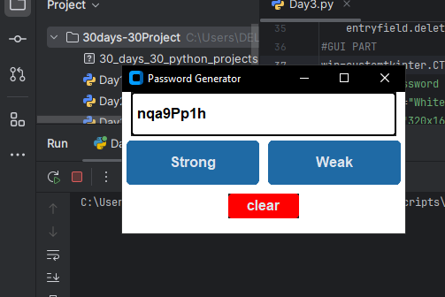
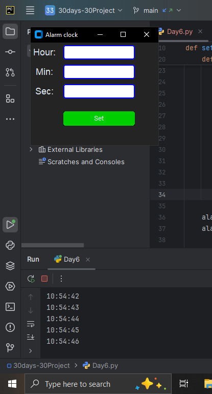
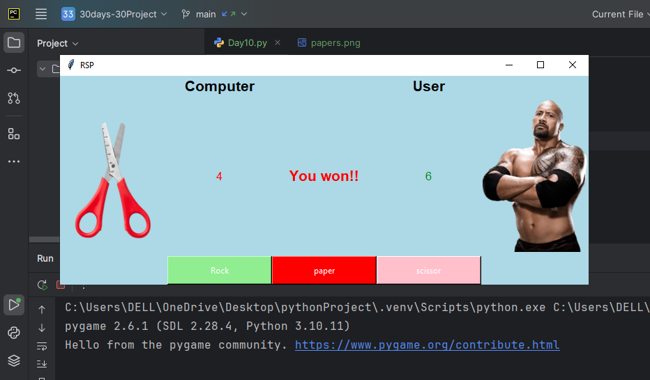
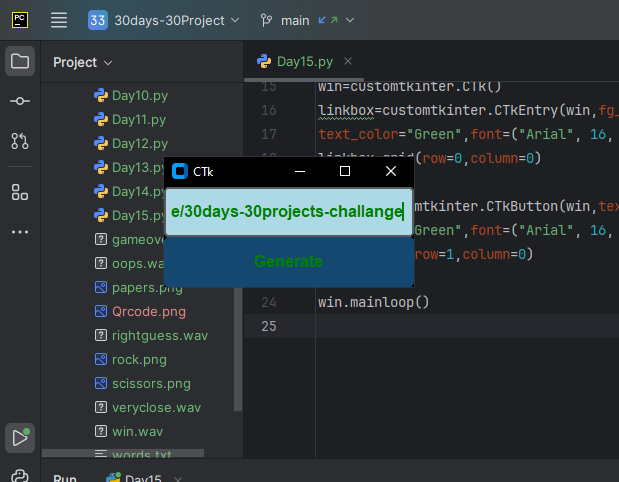
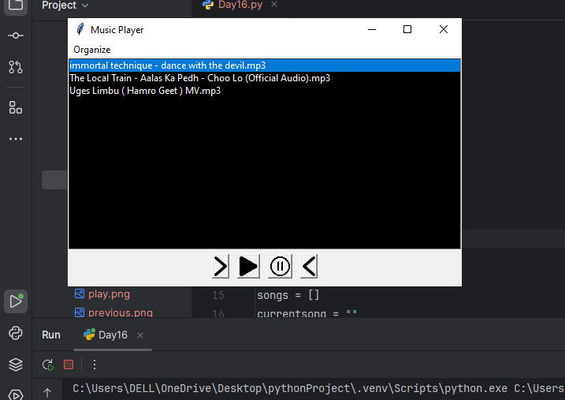
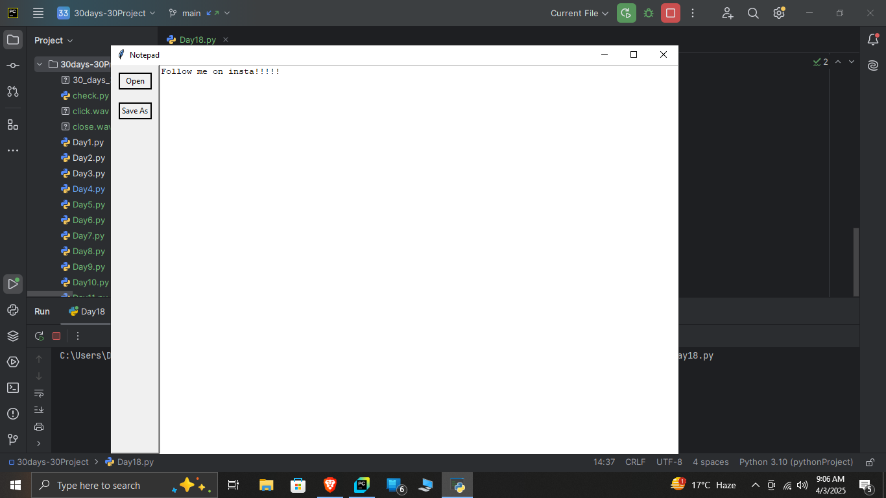

# 30 Days 30 Python Projects Challenge

This repository contains 30 Python projects that will help you enhance your programming skills in Python. Each project is simple but impactful, designed to teach various important concepts, libraries, and modules used in Python development.

## Project List

| Day | Project Name                  | Necessary Modules                               |
|-----|--------------------------------|-------------------------------------------------|
| 1   | Calculator                    | tkinter, math                                   |
| 2   | To-Do List CLI                | argparse                                        |
| 3   | Password Generator            | random, string                                  |
| 4   | Weather App                   | requests                                        |
| 5   | File Organizer                | os, shutil                                      |
| 6   | Basic Alarm Clock             | datetime, playsound                            |
| 7   | Tic-Tac-Toe (Console)         | None                                            |
| 8   | Number Guessing Game          | random                                          |
| 9   | Basic Web Scraper             | requests, BeautifulSoup                         |
| 10  | Rock-Paper-Scissors           | random                                          |
| 11  | equation solver                | z3solver                                         |
| 12  | Text-to-Speech App            | pyttsx3                                         |
| 13  | Hangman Game                  | random                                          |
| 14  | PDF Merger                    | PyPDF2                                          |
| 15  | QR Code Generator             | qrcode                                          |
| 16  | MP3 Player                    | pygame                                          |
| 17  | Chatbot (Basic)               | nltk                                            |
| 18  | Notes App (GUI)               | tkinter                                         |
| 19  | Image Resizer                 | PIL                                             |
| 20  | Currency Converter            | requests                                        |
| 21  | Voice Assistant               | speechrecognition, pyttsx3                     |
| 22  | AI Chatbot (ChatGPT API)      | openai, requests                                |
| 23  | Stock Market Analysis         | pandas, matplotlib, yfinance                   |
| 24  | Expense Tracker with SQLite   | sqlite3, tkinter                               |
| 25  | Web Automation (Form Filler)  | selenium                                        |
| 26  | URL Shortener                 | pyshorteners                                   |
| 27  | Live Face Detection           | cv2 (OpenCV)                                    |
| 28  | YouTube Video Downloader      | pytube                                          |
| 29  | Crypto Price Tracker          | requests, bs4                                  |
| 30  | Weather Dashboard (Flask)     | flask, requests                                 |

## Calculator Project - Day 1

This is a simple calculator project using the `tkinter` module. It demonstrates the basics of creating a GUI with tkinter and handling user input. The calculator supports addition, subtraction, multiplication, division, and decimal operations.

### Features:
- Basic arithmetic operations
- Error handling for invalid inputs (syntax errors, division by zero)
- Responsive GUI

### Installation:

To run this project, you will need to have Python and the `customtkinter` library installed.

You can install the necessary dependencies with:

```bash
pip install customtkinter
## Usage:
```
1. Clone the repository or download the specific project file.
2. Run the script using Python:

```bash
python calculator.py
```
### Usage Example:
- Press the buttons (0-9, +, -, *, /, ., etc.) to build the mathematical expression.
- Press the "=" button to get the result.
- Use the "clear" button to reset the input field.

### Error Handling:
- If you enter an invalid expression, a `SyntaxError` will be shown.
- If you try to divide by zero, a `ZeroDivisionError` message will be displayed.
- Any other errors will show a generic error message.

**Day1**


 

**Day 2**  
#### **CLI To-Do List App (with File Storage)**  
This project is a **command-line To-Do List application** that allows users to add, view, and remove tasks. The tasks are stored in a `todo.txt` file so they persist even after the program is closed.  

---

### **Features:**  
✅ Add new tasks  
✅ View the current task list  
✅ Remove completed tasks  
✅ Save tasks in a `todo.txt` file for persistence  

---

### **Installation:**  
Ensure you have Python installed. No additional dependencies are required.  

---

### **Usage:**  
1. **Clone the repository** or download the script.  
2. **Run the script** using:  
   ```sh
   python Day2.py
   ```
3. Choose an action from the menu:  
   - **1** → Add a new task  
   - **2** → View all tasks  
   - **3** → Remove a completed task  
   - **4** → Exit  

---

### **Example:**  
```sh
Welcome to the CLI To-Do List App!
1. Add Task
2. View Tasks
3. Remove Task
4. Exit
Choose an option: 1
Enter Task: Buy groceries
Task added successfully!

Choose an option: 2
1. Buy groceries

Choose an option: 3
Enter task number to remove: 1
Task removed!

Choose an option: 4
Exiting the app. Your tasks are saved!
```

---

### **Day 3 - GUI Password Generator**  
This project is a **password generator with a GUI** built using `customtkinter`. It allows users to generate **weak or strong passwords** based on different character sets.  

---

### **Features:**  
✅ Generate **weak passwords** (letters + numbers)  
✅ Generate **strong passwords** (letters + numbers + special characters)  
✅ Copy passwords to clipboard  
✅ Clear the password field  

---

### **Installation:**  
Install the required dependencies:  
```sh
pip install customtkinter
```

---

### **Usage:**  
1. **Clone the repository** or download the script.  
2. **Run the script** using:  
   ```sh
   python Day3.py
   ```
3. Click the **"Weak"** or **"Strong"** button to generate a password.  
4. Click **"Clear"** to reset the field.  

---

### **Example GUI:**  
- A **text field** displays the generated password.  
- Three buttons: **"Weak", "Strong", and "Clear"**.  
- The generated password appears instantly when a button is clicked.  

---



# 🌦️ Weather Data Fetcher (Day 4/30)

## 📌 Project Overview  
In this project, I used the OpenWeatherMap API to fetch real-time weather data for a specific city (Lalitpur). The program retrieves weather conditions, temperature, humidity, and the "feels like" temperature and displays the results in a neatly formatted table.

## 🛠️ Technologies Used  
- Python  
- `requests` (for making API calls)  
- `tabulate` (for formatting output)

## 🔗 API Used  
[OpenWeatherMap API](https://openweathermap.org/api)

## 💻 Code Implementation  

```python
import requests
from tabulate import tabulate

# Define city and API key
city_name = "Lalitpur"
api_key = "yourapikey"

# Construct API request URL
base_url = f"https://api.openweathermap.org/data/2.5/weather?q={city_name}&appid={api_key}&units=metric"

# Make API request
response = requests.get(base_url)

# Check if the request was successful
if response.status_code == 200:
    print('Status ok')

    # Extract data from JSON response
    data = response.json()
    weather = data['weather'][0]['description']  # e.g., mist
    temperature = data['main']['temp']
    feelslike = data['main']['feels_like']
    humidity = data['main']['humidity']

    # Create table format output
    mweather = [[humidity, feelslike, weather, temperature]]
    head = ["Humidity", "Feels Like (°C)", "Weather", "Temperature (°C)"]

    # Print formatted table
    print(tabulate(mweather, headers=head, tablefmt='grid'))
else:
    print("Failed to fetch weather data")
```
# 📊 Output Example

| Humidity | Feels Like (°C) | Weather | Temperature (°C) |
|----------|-----------------|---------|------------------|
| 87       | 18.5            | Mist    | 19.2             |


# 🔥 Key Learnings
✅ Making API requests using requests
✅ Extracting and parsing JSON data
✅ Formatting and displaying data in tabular form using tabulate

# 🚀 Next Steps
Add error handling for invalid city names
Allow user input for city selection
Extend functionality to display more weather details

## Day 5
**Directory Manager CLI**
A simple Python-based command-line tool to manage directories using os and shutil.<br>

****Features****<br>
📂 List directories (ls)<br>
📁 Enter a directory<br>
🔙 Return to the previous directory<br>
🆕 Create a new directory<br>
❌ Delete a directory<br>
📑 Copy a directory<br>
🚚 Move a directory<br>
🔴 Exit the program<br>

**requirements**<br>
Python 3.x <br>
OS module (built-in)<br>
Shutil module (built-in)<br>

**Error Handling** <br>
The script includes:<br>

🚨 Invalid input checks<br>
🚫 Permission handling<br>
🔍 File existence verification<br>
🛠 General exception handling<br>

## Day 6<br>
**Alarm Clock using Python**<br>
This is a simple alarm clock application created using Python, customTkinter, and plyer for notifications. The application allows users to set an alarm by entering the hour, minute, and second. When the time is reached, a notification is shown, and an alarm sound is played.<br>

# Features:<br>
Set hour, minute, and second for the alarm.<br>

Displays a message when the alarm goes off.<br>

Plays a beep sound at the set time.<br>

Shows desktop notification when the alarm rings.<br>

# Requirements:<br>
Python 3.x<br>

customtkinter: For GUI components.<br>

plyer: For desktop notifications.<br>

winsound: For playing sound.<br>

threading: For running the alarm in the background.<br>

# code:<br>
```python
def play_alarm():
    while True:
        now = datetime.now().strftime("%H:%M:%S")
        if timex == now:
            notification.notify(
                title='Heyyyy wake-----uppp',
                message='uth',
                timeout=8
            )
            messagebox.showerror('Error', 'Uth muji uthh!!!!!!!!!!')
            winsound.Beep(2000, 10000)
            break
```
<br>



<br>

🚀 Happy coding 

**Day 6**<br>
# Tic-Tac-Toe Game in Python<br>

This is a simple two-player Tic-Tac-Toe game implemented in Python with color outputs using `colorama` and sound effects using `pygame`.
<br>
## Requirements<br>
- `pygame` library for sound effects.<br>
- `colorama` for colored text.<br>
- `z3` for logical parsing (though it seems unused in this code).<br>

## Game Description<br>
- Player 1 uses 'X' (Green) and Player 2 uses 'O' (Red).<br>
- Players take turns entering positions (0 to 8) on the Tic-Tac-Toe grid.<br>
- The game checks for a winner after every turn.<br>
- Sounds are played when a player makes a move or when the game ends.<br>

## Code

```python
import time
from colorama import Fore, Style
import pygame
pygame.mixer.init()

def draw_board(xstate, ystate):
    zero = f'{Fore.GREEN}X{Fore.RESET}' if xstate[0] else f'{Fore.RED}O{Fore.RESET}' if ystate[0] else 0
    one = f'{Fore.GREEN}X{Fore.RESET}' if xstate[1] else f'{Fore.RED}O{Fore.RESET}' if ystate[1] else 1
    two = f'{Fore.GREEN}X{Fore.RESET}' if xstate[2] else f'{Fore.RED}O{Fore.RESET}' if ystate[2] else 2
    three = f'{Fore.GREEN}X{Fore.RESET}' if xstate[3] else f'{Fore.RED}O{Fore.RESET}' if ystate[3] else 3
    four = f'{Fore.GREEN}X{Fore.RESET}' if xstate[4] else f'{Fore.RED}O{Fore.RESET}' if ystate[4] else 4
    five = f'{Fore.GREEN}X{Fore.RESET}' if xstate[5] else f'{Fore.RED}O{Fore.RESET}' if ystate[5] else 5
    six = f'{Fore.GREEN}X{Fore.RESET}' if xstate[6] else f'{Fore.RED}O{Fore.RESET}' if ystate[6] else 6
    seven = f'{Fore.GREEN}X{Fore.RESET}' if xstate[7] else f'{Fore.RED}O{Fore.RESET}' if ystate[7] else 7
    eight = f'{Fore.GREEN}X{Fore.RESET}' if xstate[8] else f'{Fore.RED}O{Fore.RESET}' if ystate[8] else 8

    print(f"  {zero}  |  {one}  |  {two}  |")
    print(f"------------------")
    print(f"  {three}  |  {four}  |  {five}  |")
    print(f"------------------")
    print(f"  {six}  |  {seven}  |  {eight}  |")

def checkwin(xstate, ystate):
    win = [[0, 1, 2], [3, 4, 5], [6, 7, 8], [0, 3, 6], [1, 4, 7], [2, 5, 8], [0, 4, 8], [2, 4, 6]]
    for a, b, c in win:
        if(xstate[a] == xstate[b] == xstate[c] and xstate[a] != 0):
            return 1
        elif(ystate[a] == ystate[b] == ystate[c] and ystate[a] != 0):
            return -1
    return 0

print("Welcome to tic tac toe")
xstate = [0, 0, 0, 0, 0, 0, 0, 0, 0]
ystate = [0, 0, 0, 0, 0, 0, 0, 0, 0]
turn = 1

while True:
    draw_board(xstate, ystate)
    if turn == 1:
        inp = int(input("Input no for X:\n"))
        pygame.mixer.Sound("click.wav").play()
        xstate[inp] = 1
    else:
        inp = int(input("Input no for O:\n"))
        ystate[inp] = 1
        pygame.mixer.Sound("click.wav").play()
    turn = 1 - turn
    wincheck = checkwin(xstate, ystate)
    if(wincheck == 1):
        draw_board(xstate, ystate)
        print(f"\n{Fore.GREEN}X wins!!!!!!!{Fore.RESET}\n")
        sound = pygame.mixer.Sound("gameover.wav")
        sound.play()
        time.sleep(2)
        break
    elif(wincheck == -1):
        draw_board(xstate, ystate)
        print(f"\n{Fore.RED}O wins!!!!!!!{Fore.RESET}\n")
        sound = pygame.mixer.Sound("gameover.wav")
        sound.play()
        time.sleep(2)
        break
```
## Features:<br>
- Two-player game: Player 1 is X (Green) and Player 2 is O (Red).<br>
- Win conditions are checked after every move.<br>
- Sound effects for moves and game over.<br>
- Colorful output in the terminal.<br>

## How to Run
1. Install `pygame` and `colorama` using pip:<br>
```bash
   pip install pygame colorama
```
## Run the script:<br>
```bash
python tictactoe.py
```
<br>

# Day 8<br>
# Number Guessing Game<br>

## Description
A fun number guessing game where players try to guess a randomly chosen number within the range of **1 to 1,000,000**. The game provides hints based on how close the guess is to the actual number. Additionally, sound effects are played for correct and near-correct guesses.

## Features
- Randomly selects a number within a dynamic range.
- Provides hints based on the guessed number's proximity.
- Uses **pygame** to play sound effects for correct and close guesses.
- Handles invalid inputs to ensure smooth gameplay.

## Requirements
Make sure you have **Python 3** installed, along with the required dependencies:

```sh
pip install pygame
```

## How to Play
1. Run the script:
   ```sh
   python number_guess.py
   ```
2. Enter a number within **1 - 1,000,000** when prompted.
3. Receive hints based on your guess:
   - "Way too high" or "Way too low" for distant guesses.
   - "Very close! Just a bit high/low." for near-correct guesses.
   - "🎉 Congratulations!" when the correct number is guessed.
4. Enjoy the game with sound effects!

## Sound Effects
Ensure you have the following sound files in the same directory as the script:
- `rightguess.wav` (Played on correct guess)
- `close.wav` (Played when very close)
- `veryclose.wav` (Played when extremely close)

# Day 9<br>
# Dictionary App

A simple Python-based dictionary application using `Tkinter` and `requests`. This app allows you to search for words and view their meanings with part of speech and example sentences (if available).

---

## Features

- **Word Search**: Search for any word to get its meaning.
- **Definitions**: View the part of speech, definition(s), and example sentences.
- **Error Handling**: Displays an error message if the word is not found.

---

## Libraries Used

- **Tkinter**: Standard Python library for GUI applications.
- **customtkinter**: Custom version of Tkinter to provide enhanced aesthetics.
- **requests**: For making HTTP requests to the dictionary API.

---

## Installation

### 1. Clone the Repository

Clone the repository to your local machine:

```bash
git clone https://github.com/yourusername/dictionary-app.git
```


## License
This whole project is free to use and modify.

## Day 10<br>
# Rock Paper Scissors Game

This is a simple **Rock Paper Scissors** game built using **Python** and **Tkinter** for the graphical user interface. It also utilizes **Pygame** for sound effects and **PIL** for image processing.

## Features
- Graphical UI using **Tkinter**
- Rock, Paper, Scissors selection buttons
- Random choice selection for the computer
- Score tracking for both user and computer
- Sound effects for win and lose scenarios
- Uses images for a better visual representation

## Installation & Requirements
### Prerequisites:
Ensure you have Python installed on your system. You also need the following libraries:
- **tkinter** (built-in with Python)
- **customtkinter**
- **pygame**
- **Pillow**

### Install dependencies:
Run the following command to install required libraries:
```bash
pip install customtkinter pygame pillow
```

## How to Run
1. Clone the repository:
```bash
git clone https://github.com/yourusername/repository-name.git
```
2. Navigate to the project directory:
```bash
cd repository-name
```
3. Run the script:
```bash
python main.py
```

## Game Rules
- **Rock beats Scissors**
- **Scissors beat Paper**
- **Paper beats Rock**
- The game declares a winner and updates the score accordingly.

## File Structure
- `main.py` → Main Python script for running the game
- `rock.png`, `scissors.png`, `papers.png` → Image assets
- `win.wav`, `gameover.wav` → Sound effects

## Screenshots
*(You can add screenshots here to showcase the game UI)*

## License
This project is open-source and available under the MIT License.

## Author
[Pabitra-Me myself](https://github.com/CallmeChalise)


# Day 11-Equation Solver

## Overview
This Python program is an interactive equation solver that can handle various types of equations, including:

- Quadratic equations (ax^2 + bx + c = 0)
- Cubic equations (ax^3 + bx^2 + cx + d = 0)
- Simple linear equations (e.g., 3x + 2 = 8)
- Simultaneous equations with two variables

The program provides a menu-driven interface where users can select the type of equation they want to solve and input the necessary coefficients.

## Features
- **Quadratic Equation Solver:** Determines real or imaginary roots using the quadratic formula.
- **Cubic Equation Solver:** Finds real roots using NumPy's `roots` function.
- **Linear Equation Solver:** Solves simple linear equations using SymPy.
- **Simultaneous Equation Solver:** Uses Z3 solver to find solutions for two-variable equations.
- **Caching:** Utilizes `lru_cache` to store previously computed results for efficiency.

## Requirements
To run this program, you need to install the following dependencies:

```sh
pip install numpy sympy z3-solver
```

## How to Use
Run the program by executing:

```sh
python equation_solver.py
```

You will be prompted to select an operation:

1. Quadratic equation
2. Simple linear equation
3. Cubic equation
4. Simultaneous equations

Follow the prompts to enter coefficients or equations, and the program will display the solutions.

## Example Usage
### Quadratic Equation
```
Enter a,b,c "ax^2+bx+c"
a: 1
b: -3
c: 2
Real roots
x1=2
x2=1
```

### Simultaneous Equations
```
Enter first equation:
2*x + 3*y = 8
Enter second equation:
4*x - y = 2
X: 2
Y: 1
```

## Notes
- The quadratic equation solver supports complex roots.
- The cubic solver rounds the roots to the nearest integer.
- The simultaneous equation solver expects equations in `ax + by = c` format.

## License
This project is open-source and free to use under the MIT License.

## Day 12<br>

# Text-to-Speech (TTS) Using Windows SAPI  

## 📌 Description  
This is a simple **Text-to-Speech (TTS)** program that uses **Windows Speech API (SAPI)** via `win32com.client`.  
It converts user-inputted text into speech using the default system voice.  

## 🛠️ Requirements  
- Windows OS  
- Python (3.x)  
- `pywin32` module  

## 🔧 Installation  

### 1️⃣ Install Python (if not already installed)  
Download Python from [official website](https://www.python.org/downloads/) and install it.  

### 2️⃣ Install `pywin32` (Windows API for Python)  
Run the following command in the terminal or command prompt:  

```sh
pip install pywin32
```

## 🚀 Usage  
1. Run the script:  
   ```sh
   python Day12.py
   ```
2. Enter the text you want to convert to speech.  
3. Press `q` to quit.  

## 📝 Code Explanation  
```python
import win32com.client

def speak(text):
    speaker = win32com.client.Dispatch("SAPI.SpVoice")  # Initialize SAPI voice
    speaker.Voice = speaker.GetVoices().Item(0)  # Select the default voice
    speaker.Speak(text)  # Speak the text

run = True
while run:
    x = input("Enter text, press q to quit:\n")  # Get user input
    if x.lower() == "q":  # Check for exit condition
        run = False
        break
    speak(x)  # Speak the entered text
```

## 🎯 Features  
✅ Uses Windows built-in **Speech API (SAPI)**  
✅ No external dependencies except `pywin32`  
✅ Simple interactive loop for user input  

## 🔄 Customization  
- **Change the Voice:**  
  Modify this line to select a different voice:  
  ```python
  speaker.Voice = speaker.GetVoices().Item(0)  # Change 0 to another index
  ```
  To list available voices, add:
  ```python
  for index, voice in enumerate(speaker.GetVoices()):
      print(f"Voice {index}: {voice.GetAttribute('Name')}")
  ```

## 🛑 Troubleshooting  
1. **ModuleNotFoundError: No module named 'win32com'**  
   - Run `pip install pywin32`  
   - Restart the terminal or command prompt  

2. **No Sound Output**  
   - Check if your system has TTS voices installed  
   - Try changing the voice index  

---

**👨‍💻 Developed with ❤️ by [Pabitra]**

---

# Day 13-Hangman Game

A Python-based implementation of the classic **Hangman** game, where the player has to guess a word by suggesting letters. The game is visualized with a hangman drawing, and plays sound effects upon each action.

## Features

- **Visual Representation**: A graphical hangman drawing appears as the player makes incorrect guesses.
- **Sound Effects**: Background sounds play for different events (e.g., correct guess, wrong guess, game over).
- **Guessing Mechanism**: Players guess one letter at a time and receive feedback after each guess.
- **Random Word Selection**: The game selects random words from a list stored in a text file (`words.txt`).

## Requirements

Before running the game, make sure you have the following installed:

- **Python 3.x** (Python 3.6 or above recommended)
- **Pygame** library for handling sounds and other media
- **Colorama** library for colored text output

To install the required dependencies, use the following pip command:

```bash
pip install pygame colorama
```

## Setup

1. Clone or download the repository containing the `Day13.py` script and place it in a folder.
2. Create a `words.txt` file in the same folder, and add a comma-separated list of words (without spaces) for the game to use. For example:

    ```txt
    python,hacker,developer,algorithm,programming,hangman
    ```

3. Make sure you have the following sound files available in the same directory:
   - `gameover.wav` - Sound played when the game is lost
   - `close.wav` - Sound played for correct guesses
   - `oops.wav` - Sound played for incorrect guesses
   - `win.wav` - Sound played when the player wins the game

4. Now, you're ready to play the game!

## How to Play

1. Run the `Day13.py` script:
    ```bash
    python Day13.py
    ```

2. The game will display a series of dashes (`-`) representing the letters of a randomly selected word.
3. You will be asked to enter a letter. If the letter is part of the word, it will be revealed. If it's not, a stage of the hangman will be drawn.
4. You can continue guessing until you either:
   - **Guess the word correctly**, or
   - **Fail to guess within 8 attempts** (the game will end and show the correct word).
5. The game includes sound effects and visual updates as you play.

## Game Over Conditions

- **Win**: You win the game by guessing all the letters in the word correctly before running out of chances.
- **Game Over**: If you make 8 incorrect guesses, the game will end, and the correct word will be revealed.

## Sound Effects

- **close.wav**: Played when a correct letter is guessed.
- **oops.wav**: Played when an incorrect letter is guessed.
- **win.wav**: Played when you win the game.
- **gameover.wav**: Played when you lose the game.

## Example

Here's how the game may look during gameplay:

```
Welcome to Hangman!

------ (The word has 6 letters)
Enter letter:
a

Good guess! 'a' is in the word.
a----- (The word now shows "a----")

Enter letter:
e

Oops! 'e' is not in the word.
```

## License

This project is open-source and free to use. Feel free to modify and share the code!

---

This `README` provides clear instructions for setting up and playing the game, along with the necessary dependencies and assets. Let me know if you need any additional details!


# Day 14-PDF Merger

A simple Python script to merge multiple PDF files into a single PDF using `PyPDF2` and `tkinter` for file selection.

## Features
- Select multiple PDF files via a graphical file dialog
- Merge selected PDFs into a single file
- Automatic script termination after merging

## Requirements
Ensure you have Python installed (Python 3 recommended). Install the required dependencies using:
```sh
pip install pypdf2
```

## Usage
Run the script with:
```sh
python Day14.py
```

### Steps:
1. A file selection dialog will open.
2. Select the PDFs you want to merge.
3. Click 'Open' to confirm your selection.
4. The merged PDF (`Merged.pdf`) will be created in the same directory as the script.
5. The script will exit automatically after merging.

## Code Overview
```python
from PyPDF2 import PdfWriter
import tkinter as tk
from tkinter import filedialog
import sys

def select_file():
    filepaths = filedialog.askopenfilenames(title="Select PDF Files")
    return list(filepaths)

root = tk.Tk()
root.withdraw()

pdfs = select_file()
if not pdfs:
    print("No files selected. Exiting.")
    sys.exit()

merger = PdfWriter()
for pdf in pdfs:
    merger.append(pdf)

merger.write("Merged.pdf")
merger.close()

print("✅ PDFs merged successfully into 'Merged.pdf'. Exiting...")
sys.exit()
```

## License
This project is open-source and available under the MIT License.

## Contributing
Feel free to submit pull requests or open issues for improvements!

## Author
[Pabitra]

# Day15-QR Code Generator

This is a simple QR Code Generator built using Python, `qrcode`, and `customtkinter`. It allows users to enter a URL or text, generate a QR code, and display it instantly.

## Features

- Generates QR codes from any text or URL input.
- Uses `customtkinter` for a modern GUI.
- Saves the generated QR code as `Qrcode.png`.
- Displays the QR code immediately after generation.
- Simple and lightweight design.

## Installation

### 1. Clone the Repository

```bash
git clone https://github.com/yourusername/qr-code-generator.git
cd qr-code-generator
```

### 2. Install Dependencies

Make sure you have Python installed, then run:

```bash
pip install qrcode[pil] customtkinter
```

## Usage

Run the script using:

```bash
python Day15.py
```

### Steps:

1. Enter the text or link in the input box.
2. Click the **Generate** button.
3. The QR code will be generated, saved as `Qrcode.png`, and displayed.

## Dependencies

- `qrcode`: For generating QR codes.
- `customtkinter`: For a modern graphical user interface.

## Screenshots


## License

This project is licensed under the MIT License. Feel free to use and modify it!

## Contributing

Feel free to fork this repository and submit pull requests. Any improvements and suggestions are welcome!

## Author

Created by **Pabitra**.

---

Happy Coding! 🚀



# Day-16 Music Player

A simple music player built using Tkinter and Pygame that allows users to load and play MP3 files from a selected folder.

## Features
- Load MP3 files from a selected folder
- Play, pause, and resume music
- Navigate to the next and previous songs
- Graphical user interface using Tkinter

## Requirements
Make sure you have the following dependencies installed:
- Python 3.x
- Tkinter (comes pre-installed with Python)
- Pygame

## Installation
1. Clone this repository:
   ```sh
   git clone https://github.com/yourusername/music-player.git
   cd music-player
   ```
2. Install dependencies:
   ```sh
   pip install pygame
   ```
3. Run the script:
   ```sh
   python music_player.py
   ```

## Usage
1. Click on **Organize > Select Folder** to load MP3 files.
2. Use the buttons to play, pause, go to the next song, or go back to the previous song.

## File Structure
```
├── music_player.py  # Main Python script
├── play.png         # Play button image
├── pause.png        # Pause button image
├── next.png         # Next button image
├── previous.png     # Previous button image
└── README.md        # This file
```

## License
This project is open-source and available under the MIT License.

## Author
[Pabitra chalisep40](https://github.com/yourusername)




# Simple Notepad Application


A lightweight Notepad application built with Python and Tkinter, featuring file open/save functionality with a clean interface.



## Features ✨

- 📂 **File Operations**: Open and save text files (`.txt` or any format)
- 📝 **Clean GUI**: Responsive layout with resizable text area
- 🖱️ **User-Friendly**: File type filters and clear error handling
- 🏷️ **Dynamic Title**: Shows current filename in window title

## Installation ⚙️

1. **Prerequisites**:
   - Python 3.7 or higher

2. **Run the application**:
   ```bash
   git clone https://github.com/yourusername/notepad-app.git
   cd notepad-app
   python notepad.py
   ```

## Usage 🖥️

- **Open Files**: Click "Open" to load any text file
- **Save Files**: Use "Save As" to save your work
- **Text Editing**: Standard text editing with copy/paste support (Ctrl+C/Ctrl+V)

## Customization 🎨

Easily modify the code to add:
- Dark mode (update colors in `tk.Text`)
- Keyboard shortcuts (add `win.bind()`)
- Line numbers (custom `Canvas` implementation)

## Contributing 🤝

Pull requests are welcome! For major changes, please open an issue first.

## License 📄

[MIT](LICENSE)

---

*Created with ❤️ using Python and Tkinter*


# 📸 Image Resizer Tool(Day19)
**By Pabitra** | 🛠️ Built with Python + Pillow  

A simple GUI tool to resize images (PNG/JPG/JPEG) while maintaining aspect ratio. Perfect for quick bulk resizing!  

---

## 🚀 Features  
- **GUI file picker** (no manual path typing!)  
- **Custom width/height** input  
- **Preserves original format** (`.png`, `.jpg`, `.jpeg`)  
- **Instant preview** of resized image  

---

## ⚙️ Installation  
1. Install Python 3.x  
2. Install dependencies:  
```bash
pip install pillow tk
```

---

## 👨‍💻 Usage  
Run the script:  
```python
import os.path
from PIL import Image
from tkinter.filedialog import askopenfilename

# Select image
path = askopenfilename(filetypes=[('PNG Files', '*.png'), ('JPG Files', '*.jpg'), ('All Files', '*.*')])
img = Image.open(path)

# Input new dimensions
print("Input size")
width = int(input("Enter width:--> "))
height = int(input("Enter height:--> "))
size = (width, height)

# Resize and save
if path.lower().endswith(('.png', '.jpg', '.jpeg')):
    filename, extension = os.path.splitext(path)
    resized_image = img.resize(size)
    resized_image.save(f"resized{extension}")
    resized_image.show()  # Preview
```

---

## 🧠 How It Works  
1. **`askopenfilename()`**: Opens a file dialog to pick an image.  
2. **`Pillow`**: Handles image resizing with `Image.resize()`.  
3. **Dynamic Saving**: Keeps the original file extension (e.g., `resized.jpg`).  

---

## 🌟 Pro Tip  
Add this to resize **multiple images** in a folder:  
```python
from pathlib import Path

for img_path in Path("your_folder").glob("*.*"):
    if img_path.suffix.lower() in ('.png', '.jpg', '.jpeg'):
        img = Image.open(img_path)
        img.thumbnail((800, 800))  # Max 800x800, keeps aspect ratio
        img.save(f"resized_{img_path.name}")
```

---

## 📜 License  
MIT © Pabitra  

**Star ⭐ if you find this useful!**  

--- 

### 🔧 Dependencies  
- Python 3.x  
- `Pillow` (`pip install pillow`)  
- `Tkinter` (built-in with Python)  

---

### Currency Converter(Day-20)

A simple Python script that converts currencies using the ExchangeRate-API.

## Features

- Real-time currency conversion
- Supports all major currencies
- Simple command-line interface
- Error handling for API responses

## Requirements

- Python 3.x
- `requests` library (install with `pip install requests`)

## Usage

1. Replace `"Yourapi"` in the script with your actual ExchangeRate-API key
2. Run the script with `python Day20.py`
3. Enter:
   - The currency to convert from (e.g., USD)
   - The currency to convert to (e.g., EUR)
   - The amount you want to convert

## Example

```
Enter currency to be converted:
USD
Enter the currency to convert in:
EUR
1 USD = 0.85 EUR
Enter amount:
100
Amount in EUR:85.00
```

## API Note

You'll need to get a free API key from [ExchangeRate-API](https://www.exchangerate-api.com/).

## Author

Created by Pabitra

---

# Voice Assistant - Personal AI Assistant  (Day21)

A simple **voice-controlled assistant** built with Python that responds to voice commands, opens websites, and greets you based on the time of day.  

  
  
  

## 🎤 Features  
- **Voice Interaction**: Responds to spoken commands.  
- **Smart Greeting**: Says "Good morning/afternoon/evening" based on time.  
- **Web Automation**: Opens websites like YouTube, ChatGPT, Instagram, and GitHub.  
- **Text-to-Speech**: Uses `SAPI.SpVoice` (Windows) for voice feedback.  

## ⚙️ Installation  
1. **Clone the repository**  
   ```sh
   git clone https://github.com/yourusername/voice-assistant.git
   cd voice-assistant
   ```  

2. **Install dependencies**  
   ```sh
   pip install SpeechRecognition pywin32 webbrowser
   ```  

   *(For microphone access, ensure `pyaudio` is installed. If errors occur, try:)*  
   ```sh
   pip install pipwin
   pipwin install pyaudio
   ```  

3. **Run the assistant**  
   ```sh
   python Day21.py
   ```  

## 🎙️ Available Commands  
| Command | Action |  
|---------|--------|  
| **"Open YouTube"** | Opens YouTube |  
| **"Open GPT"** | Opens ChatGPT |  
| **"Open my website"** | Opens `pabitrachalise.com.np` |  
| **"Open Insta"** | Opens Instagram |  
| **"Open Git"** | Opens GitHub |  
| **"Quit" / "Exit"** | Closes the program |  

## 🛠️ Customization  
- **Add more websites**: Modify `openweb()` in the code.  
- **Change voice**: Adjust `SAPI.SpVoice` settings (Windows only).  
- **Extend commands**: Add new `if-elif` conditions in `takecommand()`.  


---
**Note**: This project is optimized for **Windows** (due to `win32com`). For macOS/Linux, consider using `pyttsx3` instead.  


