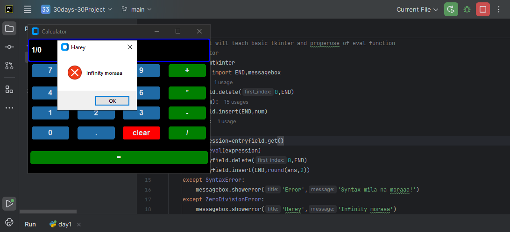
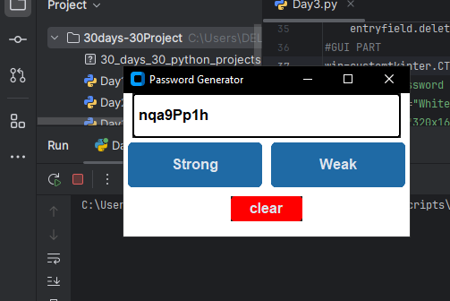

# 30 Days 30 Python Projects Challenge

This repository contains 30 Python projects that will help you enhance your programming skills in Python. Each project is simple but impactful, designed to teach various important concepts, libraries, and modules used in Python development.

## Project List

| Day | Project Name                  | Necessary Modules                               |
|-----|--------------------------------|-------------------------------------------------|
| 1   | Calculator                    | tkinter, math                                   |
| 2   | To-Do List CLI                | argparse                                        |
| 3   | Password Generator            | random, string                                  |
| 4   | Weather App                   | requests                                        |
| 5   | File Organizer                | os, shutil                                      |
| 6   | Basic Alarm Clock             | datetime, playsound                            |
| 7   | Tic-Tac-Toe (Console)         | None                                            |
| 8   | Number Guessing Game          | random                                          |
| 9   | Basic Web Scraper             | requests, BeautifulSoup                         |
| 10  | Rock-Paper-Scissors           | random                                          |
| 11  | equation solver                | z3solver                                         |
| 12  | Text-to-Speech App            | pyttsx3                                         |
| 13  | Hangman Game                  | random                                          |
| 14  | PDF Merger                    | PyPDF2                                          |
| 15  | QR Code Generator             | qrcode                                          |
| 16  | MP3 Player                    | pygame                                          |
| 17  | Chatbot (Basic)               | nltk                                            |
| 18  | Notes App (GUI)               | tkinter                                         |
| 19  | Image Resizer                 | PIL                                             |
| 20  | Currency Converter            | requests                                        |
| 21  | Voice Assistant               | speechrecognition, pyttsx3                     |
| 22  | AI Chatbot (ChatGPT API)      | openai, requests                                |
| 23  | Stock Market Analysis         | pandas, matplotlib, yfinance                   |
| 24  | Expense Tracker with SQLite   | sqlite3, tkinter                               |
| 25  | Web Automation (Form Filler)  | selenium                                        |
| 26  | URL Shortener                 | pyshorteners                                   |
| 27  | Live Face Detection           | cv2 (OpenCV)                                    |
| 28  | YouTube Video Downloader      | pytube                                          |
| 29  | Crypto Price Tracker          | requests, bs4                                  |
| 30  | Weather Dashboard (Flask)     | flask, requests                                 |

## Calculator Project - Day 1

This is a simple calculator project using the `tkinter` module. It demonstrates the basics of creating a GUI with tkinter and handling user input. The calculator supports addition, subtraction, multiplication, division, and decimal operations.

### Features:
- Basic arithmetic operations
- Error handling for invalid inputs (syntax errors, division by zero)
- Responsive GUI

### Installation:

To run this project, you will need to have Python and the `customtkinter` library installed.

You can install the necessary dependencies with:

```bash
pip install customtkinter
## Usage:
```
1. Clone the repository or download the specific project file.
2. Run the script using Python:

```bash
python calculator.py
```
### Usage Example:
- Press the buttons (0-9, +, -, *, /, ., etc.) to build the mathematical expression.
- Press the "=" button to get the result.
- Use the "clear" button to reset the input field.

### Error Handling:
- If you enter an invalid expression, a `SyntaxError` will be shown.
- If you try to divide by zero, a `ZeroDivisionError` message will be displayed.
- Any other errors will show a generic error message.

**Day1**




 

**Day 2**  
#### **CLI To-Do List App (with File Storage)**  
This project is a **command-line To-Do List application** that allows users to add, view, and remove tasks. The tasks are stored in a `todo.txt` file so they persist even after the program is closed.  

---

### **Features:**  
✅ Add new tasks  
✅ View the current task list  
✅ Remove completed tasks  
✅ Save tasks in a `todo.txt` file for persistence  

---

### **Installation:**  
Ensure you have Python installed. No additional dependencies are required.  

---

### **Usage:**  
1. **Clone the repository** or download the script.  
2. **Run the script** using:  
   ```sh
   python Day2.py
   ```
3. Choose an action from the menu:  
   - **1** → Add a new task  
   - **2** → View all tasks  
   - **3** → Remove a completed task  
   - **4** → Exit  

---

### **Example:**  
```sh
Welcome to the CLI To-Do List App!
1. Add Task
2. View Tasks
3. Remove Task
4. Exit
Choose an option: 1
Enter Task: Buy groceries
Task added successfully!

Choose an option: 2
1. Buy groceries

Choose an option: 3
Enter task number to remove: 1
Task removed!

Choose an option: 4
Exiting the app. Your tasks are saved!
```

---

### **Day 3 - GUI Password Generator**  
This project is a **password generator with a GUI** built using `customtkinter`. It allows users to generate **weak or strong passwords** based on different character sets.  

---

### **Features:**  
✅ Generate **weak passwords** (letters + numbers)  
✅ Generate **strong passwords** (letters + numbers + special characters)  
✅ Copy passwords to clipboard  
✅ Clear the password field  

---

### **Installation:**  
Install the required dependencies:  
```sh
pip install customtkinter
```

---

### **Usage:**  
1. **Clone the repository** or download the script.  
2. **Run the script** using:  
   ```sh
   python Day3.py
   ```
3. Click the **"Weak"** or **"Strong"** button to generate a password.  
4. Click **"Clear"** to reset the field.  

---

### **Example GUI:**  
- A **text field** displays the generated password.  
- Three buttons: **"Weak", "Strong", and "Clear"**.  
- The generated password appears instantly when a button is clicked.  

---



🌦️ Weather Data Fetcher (Day 4/30)
📌 Project Overview
In this project, I used the OpenWeatherMap API to fetch real-time weather data for a specific city (Lalitpur). The program retrieves weather conditions, temperature, humidity, and the "feels like" temperature and displays the results in a neatly formatted table.

🛠️ Technologies Used
Python
requests (for making API calls)
tabulate (for formatting output)
🔗 API Used
OpenWeatherMap API

💻 Code Implementation
python
Copy
Edit
import requests
from tabulate import tabulate

# Define city and API key
city_name = "Lalitpur"
api_key = "8578b0e1d22b100909c7a832bfa2e0f7"

# Construct API request URL
base_url = f"https://api.openweathermap.org/data/2.5/weather?q={city_name}&appid={api_key}&units=metric"

# Make API request
response = requests.get(base_url)

# Check if the request was successful
if response.status_code == 200:
    print('Status ok')

    # Extract data from JSON response
    data = response.json()
    weather = data['weather'][0]['description']  # e.g., mist
    temperature = data['main']['temp']
    feelslike = data['main']['feels_like']
    humidity = data['main']['humidity']

    # Create table format output
    mweather = [[humidity, feelslike, weather, temperature]]
    head = ["Humidity", "Feels Like (°C)", "Weather", "Temperature (°C)"]

    # Print formatted table
    print(tabulate(mweather, headers=head, tablefmt='grid'))
else:
    print("Failed to fetch weather data")
📊 Output Example
sql
Copy
Edit
+-----------+----------------+---------+----------------+
| Humidity  | Feels Like (°C)| Weather | Temperature (°C) |
+-----------+----------------+---------+----------------+
| 87        | 18.5           | Mist    | 19.2           |
+-----------+----------------+---------+----------------+
🔥 Key Learnings
✅ Making API requests using requests
✅ Extracting and parsing JSON data
✅ Formatting and displaying data in tabular form using tabulate

🚀 Next Steps
Add error handling for invalid city names
Allow user input for city selection
Extend functionality to display more weather details
